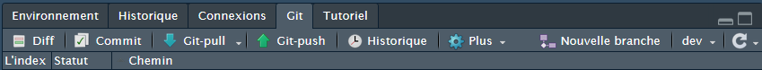
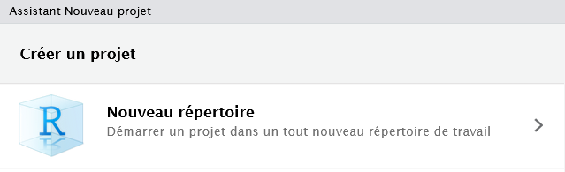
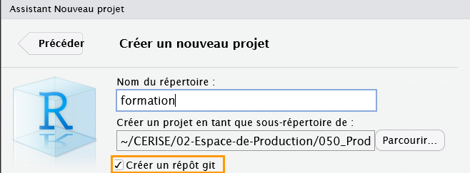

# Les bases de Git {.backgroundTitre}

## Qu'est-ce qu'on versionne ?

<p style="text-align: center;">[On versionne les fichiers de type texte]{.content-box-green}</p>

Par exemple :

-   Les programmes R, Python, SAS...\
-   La documentation au format texte, Markdown...\
-   Les fichiers quarto, Rmarkdown...\
-   Les fichiers de configuration de type yaml par exemple...

Éventuellement, on peut aussi versionner **des images** si on en a
besoin dans une application ou une documentation.

## Qu'est-ce qu'on NE versionne PAS ? (1/2)

<p style="text-align: center;">[TOUT LE RESTE :)]{.content-box-red}</p>  

<br>

**C'est-à-dire notamment les fichiers tableurs, de traitements de texte,
les pdf, les diaporamas de type powerpoint ou impress, les fichiers
spécifiques aux projets R...**

Pour se faciliter la tâche, on utilise un fichier spécifique
`.gitignore` situé le plus souvent à la racine des projets.

Il s'agit d'un fichier texte que vous devez éditer, qui liste les fichiers et dossiers (sous
forme d'expressions régulières) à ne pas versionner.

-- une ligne = une règle ;

-- on peut ignorer :\
• des fichiers (exemple : `donnees.rds`)\
• des dossiers (exemple : `data/`)\
• des extensions (exemple : `*.xls`)\
• ...

## Qu'est-ce qu'on NE versionne PAS ? (2/2)

Voici un exemple de fichier `.gitignore` qui peut servir de base pour une ré-utilisation :  

```         
.Rproj.user
.Rhistory
.RData
.Renviron
.Ruserdata

/* Les fichiers avec ces extensions
*.xls
*.xlsx
*.ods
*.pdf
*.docx
*.odt
*.ppt
*.odp
```

## Comment utiliser Git ?

2 façons seront présentées dans ce support :

-   {.inlineimage} Via l'interface visuelle de
    l'IDE RStudio\
    [Pour les commandes les plus courantes du quotidien]{.Macaron2}

-   {.inlineimage} Via les commandes du
    terminal\
    [Pour les commandes plus avancées]{.Macaron2}

## Installer Git

- **Si vous travaillez avec Cerise**, Git est déjà installé.  
=> Vous pouvez directement commencer à l'utiliser.
(il vous faudra simplement régler votre configuration pour faire en sorte de dialoguer 
avec la forge interne Gitlab => voir [ici](#dialoguer-avec-gitlab))

- **Si vous travaillez en local**, consultez [cette procédure interne au MASAA](https://orion.agriculture/confluence/display/CER/GIT+-+Installation+en+local)


## Git avec RStudio 

[Pré-requis : pour pouvoir utiliser correctement Git avec l'IDE RStudio,
il convient d'utiliser le mode projet.]{.red}


### Comment savoir si un projet R est versionné avec Git ?

-   Un fichier `.git` {.inlineimage} est présent
    dans l'explorateur de fichier.

::: callout-note
Pensez à cocher la case
{.inlineimage}
:::

-   À l'ouverture du projet R, un onglet Git s'affiche dans RStudio :
    {fig-align="center"}

[=\> Une utilisation de Git en cliquant sur les boutons de
RStudio]{.red}

## Git avec le terminal 

-   En local, vous pouvez directement utiliser les commandes du terminal
    sans RStudio.

Pour cela, il vous suffit de vous placer dans le bon répertoire (par
exemple avec la commande `cd` pour `change directory`).

-   Sur un server Posit comme Cerise, le terminal est désormais intégré
    dans les sessions RStudio à côté de la console classique de R
    {.inlineimage}

Vous pouvez alors soit utiliser la même méthode qu'en local avec la
commande `cd` soit de préférence :

-   Vous placez dans le répertoire voulu dans l'explorateur de fichiers\
-   Cliquez sur le bouton `Plus` en haut à droite\
-   Cliquez sur le bouton
    {.inlineimage}

[=\> Une utilisation de Git en tapant des commandes qui commencent par
git...]{.red}


## Initialiser un dossier local en dépôt Git avec RStudio 

Créer un nouveau projet puis choisir un nouveau répertoire :  

{fig-align="center"} 

Après avoir choisi le nom du nouveau projet, cocher la case "Créer un répôt git" :  

{fig-align="center"}  


## Initialiser un dossier local en dépôt Git avec le terminal 

<br> 

**La commande `git init` permet d'initialiser un dossier avec Git**  

Cette commande crée un nouveau sous-répertoire nommé `.git` qui contient tous les 
fichiers nécessaires au dépôt — un squelette de dépôt Git.  

Pour l’instant, aucun fichier n’est encore versionné !  

::: callout-important
Il s'agit d'être vigilant sur l'emplacement du terminal au moment du lancement de 
la commande `git init` au risque d'initialiser le mauvais répertoire !
:::

::: callout-note
## Astuce
Lors de l'initialisation du dépôt Git, on peut directement choisir le nom de la 
branche avec la commande `git init --initial-branch=<nom-de-branche>`.  
=> voir [partie 4](#travailler-avec-une-forge) de ce support
:::
