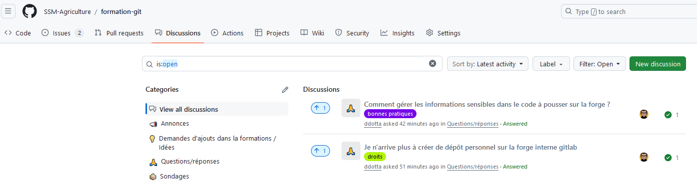

# Pour en savoir plus {.backgroundTitre}

## Ressources complémentaires ou pour chercher de l'aide

- Consultez [le wiki](https://github.com/SSM-Agriculture/formation-git/wiki) de la formation qui contient :
    - Les corrections des exercices à télécharger et imprimer ;
    - Des ressources complémentaires (cheatsheet, tutoriels de connexion à Gitlab depuis Cerise...)

- Poser vos questions directement sur [l'espace discussions](https://github.com/SSM-Agriculture/formation-git/discussions) de la formation.

{fig-align="center"}

## Bibliographie à consulter

En français :  

- [Documentation officielle de Git en français](https://git-scm.com/book/fr/v2/D%C3%A9marrage-rapide-Installation-de-Git)  
- [Les fiches consacrées à Git dans utilitr](https://www.book.utilitr.org/)  
- [Formation aux bonnes pratiques avec Git et R](https://inseefrlab.github.io/formation-bonnes-pratiques-git-R/) par l'Insee  
- [Tutoriel Git](https://www.atlassian.com/fr/git/tutorials) par Atlassian  

En anglais :  

- [Happy Git and Github for the useR](https://happygitwithr.com/) par Jennifer Bryan (Posit)  
- [Cheatsheet - Using Git and Github with RStudio](https://rstudio.github.io/cheatsheets/git-github.pdf)  

## Remerciements

Le DEMESIS remercie par avance tous les relecteurs/contributeurs à cette formation qui en feront un meilleur support pour la communauté française de R et en particulier pour les utilisateurs de RStudio.

